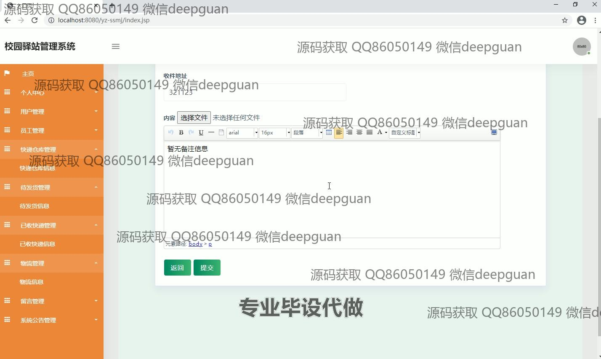

<h1 align="center">基于Java Web的校园驿站管理系统</h1>

## 简介
校园驿站管理系统：角色分为管理员、员工、用户；支持用户管理、员工管理、快递仓库管理、物流信息管理、留言管理、系统公告管理、快递签收等功能。    --计算机毕业设计源码；毕设源码；java毕业设计源码

## 联系方式

<h3 align="center">获取完整代码与数据库文件 + 微信：deepguan QQ: 86050149 QQ群: 783742310</h3>

<h3 align="center">可帮忙远程部署 包运行成功！提供远程部署、修改代码、设计文档指导、代码讲解等服务！</h3>

## 功能介绍（完整见运行截图）
管理员：负责系统管理，包括用户管理、员工管理、快递仓库管理和留言管理，支持新增、查询、修改和批量删除操作；维护快递信息，如物流单号、寄件人、收件人和物流状态；设置系统公告，提供密码修改功能，确保系统安全性和数据完整性。

员工：处理快递仓库业务，录入和管理快递信息，包括快递名称、类型、收发件人及其联系方式，跟进快递状态；协助完成发货、收货和物流信息更新，支持通过筛选功能快速定位特定状态的快递；操作界面简洁高效，便于日常操作。

用户：支持注册、登录和退出，提供个人中心模块用于查看和修改个人信息，管理订单和地址；支持快递信息查询，确认收货及留言反馈；界面简洁，方便用户查看快递动态并与驿站互动。

访客：访问系统首页，浏览驿站介绍和公告信息；支持初次注册，快速进入用户角色；访问功能菜单模块了解系统功能布局和操作指引，便于了解和加入驿站管理服务。

## 运行截图

本代码来源于网络,仅供学习参考使用!

